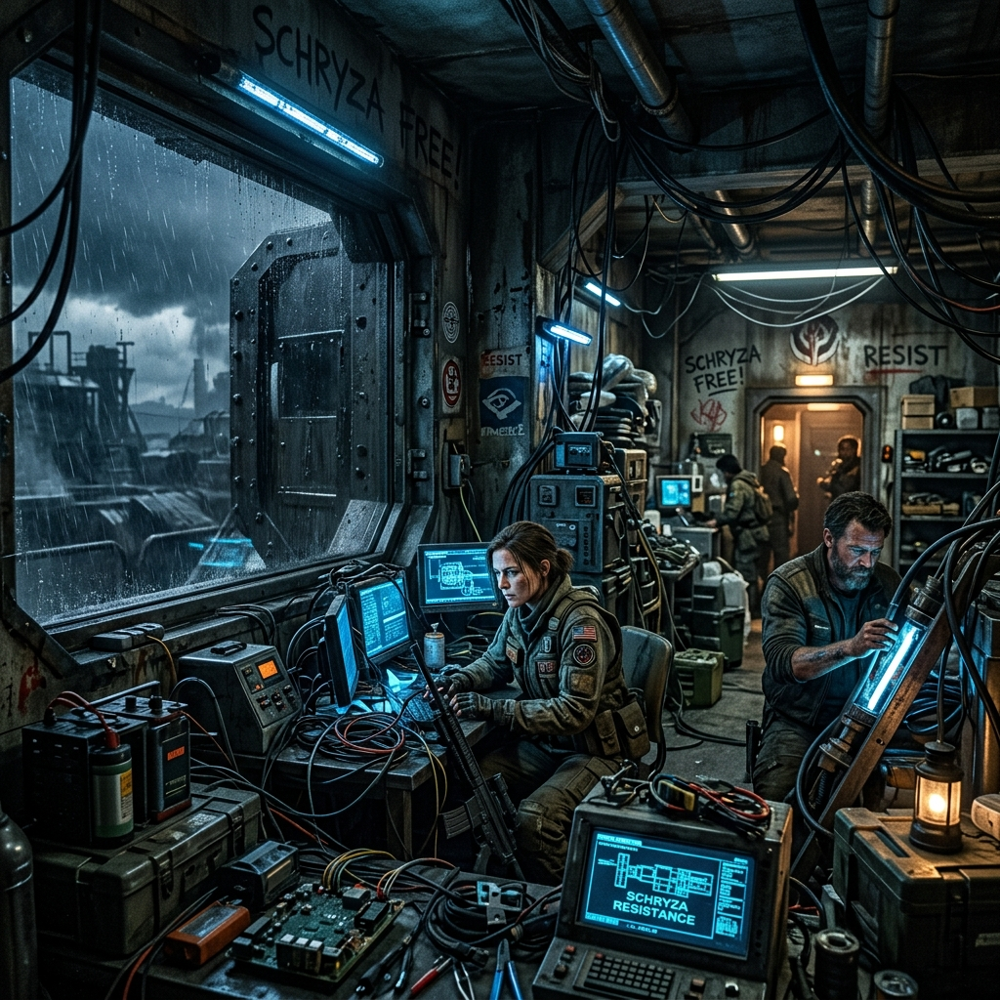

# Phantasm of Xydos - Challenge (Schryza Resistance)

<p align="center">
  
</p>
<p align="center">
  
</p>

<br>
<p align="center">
  <a href="https://www.youtube.com/watch?v=Aa7SyxcKTbs">
    
  </a>
  <br><br>
  <a href="../Story/English_STORY.md">
    
  </a><br>
  <i>(Highly recommended before you start the challenge!)</i>
</p>
<br>

## Table of Contents
1. [I: PROLOGUE](#i-prologue)
2. [II: THE KOURA SISTERS (RESISTANT UNITS)](#ii-the-koura-sisters-resistant-units)
3. [III: THE CHALLENGE](#iii-the-challenge)
    - [System Capabilities](#field-manual-system-capabilities)
    - [Understanding `argc` and `argv`](#understanding-argc-and-argv)
    - [Memory Alignments & Secret Modulos](#memory-alignments--secret-modulos)
    - [Sample Inputs and Outputs](#sample-inputs-and-outputs)
4. [IV: CLOSING REMARKS](#iv-closing-remarks)

---

## I: PROLOGUE
### The Fugitive Architect of Schryza

Before the war, CyroN was a lifeline that healed planets. Now, under the corrupted influence of the goddess Xelisa, it is an authoritarian empire that weaponizes divinity. You are a Memory Architect on the run. Disgusted by their cold "Divine Optimization," you have escaped their golden halls to the stormy, industrial wastes of Schryza.

In a hidden resistance base, you meet the survivors: Historia and Mira Koura. They are rebel units who chose freedom over the CyroN hierarchy. Their neural cores are damaged, and their memory pointers are heavily fragmented from their escape. 

*"Thank you... for bringing hope,"* Historia whispers as you boot up your terminal.

Even Victoria, the eldest sister who was weaponized into the "Divine Countermeasure," has been brought to you by the resistance. They hope your architectural skills can heal her—something CyroN's optimization failed to do.

You aren't paid in gold anymore; you are paid in hope. It's time to turn the tides. It's time to tear down CyroN!

---

## II: THE KOURA SISTERS
### Resistant Units on Schryza

| | |
| :--- | :--- |
|  | **Name:** Historia Koura (XMA-02A)<br>**Alliance:** Resistance Commander<br>**Xydos:** Lagta (Thunder & Abyss)<br>**Memory Size:** 1024 bytes (Shattered Core)<br>**Alignment:** 16 bytes |

| | |
| :--- | :--- |
|  | **Name:** Mira Koura (XMA-03C)<br>**Alliance:** Resistance Healer<br>**Xydos:** Daiki (Wind & Wood)<br>**Memory Size:** 2048 bytes (Stable Core)<br>**Alignment:** 8 bytes |

| | |
| :--- | :--- |
|  | **Name:** Victoria Koura (XMA-01F)<br>**Alliance:** Neutral / Fallen<br>**Xydos:** ??? (Artificial Xydos)<br>**Memory Size:** 4096 bytes (Corrupted Core)<br>**Alignment:** 4 bytes |

---

## III: THE CHALLENGE

Your task is to build a "Resistance Recovery Terminal" (TUI) to repair the neural cores of the Koura Sisters.

### FIELD MANUAL: SYSTEM CAPABILITIES
The Schryza Resistance operates on limited resources. To succeed, you must master the following technical specifications of the Terminal:

#### 1. Neural Alignment & The Special Gap
*   **The Problem**: CPU architectures require memory addresses to be *aligned* to specific boundaries. Historia requires **16-byte** alignment, Mira **8-byte**, and Victoria **4-byte**.
*   **The Special Gap**: Every `char*` allocation is forced to include a "Special Gap" calculated from your **Student ID**.
    *   **Historia**: Gap = 1 if the last digit of your ID is Odd, 0 if Even.
    *   **Mira**: Gap = (Last 3 Digits &times; 7 % 23) + 12.
    *   **Victoria**: Uses a sliding modulo based on prime numbers.
*   **Formula**: `Final_Offset = Aligned(Current_Offset) + Special_Gap`.

#### 2. Advanced Tail Reclamation
*   **The Fact**: Unlike standard `realloc`, our system does not automatically tidy up fragmented memory blocks.
*   **Capability**: If you delete the *highest index* from a core (the "Tail"), the `bump` pointer will shift backward, immediately reclaiming that space.
*   **Limitation**: If you delete an entry while a higher index still exists, that space becomes *orphaned* (fragmented). You must "Purge from the top down" to properly reclaim the memory.

#### 3. Pool Resizing & Memory Dangers
*   **Capability**: The terminal can `realloc()` a sister's entire memory pool.
*   **The Trap**: If you shrink a pool (e.g., from 1024 to 512 bytes) while high-offset entries still exist, those entries become **Out of Bounds**. The terminal will give a warning, and the data beyond the new limit is automatically lost or corrupted.
*   **Resizing Logic**: The `bump` pointer will be clamped to the new `pool_size` if it was previously larger.

#### 4. Diagnostic Metrics
*   **Utilization %**: Calculated as `(Used_Bytes / Pool_Size) * 100`. Note that alignment gaps and the "Special Gap" count towards memory consumption but do not count as "Used Bytes" (raw data).
*   **Used Slots**: Tracks how many `Memory_Entry` slots are currently active. Maximum capacity is **128 entries** per person.

### Initial Resistance Data (The Foundation)
When the terminal boots up, you will see that the sisters' cores have been partially restored with vital data. Use this as a baseline for your alignment calculations:

*   **Historia**:
    *   `[0]` Type: `char*` | Value: "Historia: Schryza will be free."
    *   `[1]` Type: `int` | Value: `333` (Resistance Frequency)
*   **Mira**:
    *   `[0]` Type: `char*` | Value: "Mira: The winds are changing."
    *   `[1]` Type: `uint` | Value: `101`
*   **Victoria**:
    *   `[0]` Type: `char*` | Value: "Victoria: Fragment of the First Light."

### Understanding `argc` and `argv`
To prevent CyroN from tracking your location, your terminal requires an **Encrypted Identity** (Student ID).
- `argc`: Counts the argument pulses.
- `argv`: Captures your encrypted identity string (Student ID).

You must validate your ID (format `F1D02xxxxxx`) or the Base's firewall will block your access.

### Memory Alignments & Secret Modulos
Every byte is precious when using scavenged hardware. You must resolve the "Jump" gaps to minimize the memory footprint of each allocation.

The sisters' cores are constrained by a **Gap Increment** controlled via a `union Gap`! You must extract the parity from your ID to calculate this gap. CyroN used this trick to suppress their divine powers; you will use it to heal them.

### Proper Memory Allocation (The Danger Zone)
When dealing with raw memory in a warzone, a single typo or logic flaw can be fatal.
*   **`malloc()`**: Claims memory blocks.
*   **`realloc()`**: Resizes them.
*   **`free()`**: Returns memory to the system.

**The Rules of Engagement:** Always allocate *exactly* what you need. Buffer overflows can reveal your location to CyroN, and memory leaks will drain the base's resources. Handle pointers with extreme caution!

### Sample Inputs and Outputs

**[1] Initialization**
```bash
$ ./solution.exe F1D02410053
SCHRYZA RESISTANCE — RECOVERY PROTOCOL [TERMINAL: PHOENIX]
```

**[2] Menu 4: Recovery (Add)**
```text
Choose: 4
Historia whispers: "Thank you for finding me. Align me to 16, and use the 1-byte spark to guide the thunder."
Lagta: "Integers strike back; four bytes of rebellious thunder."
Added string to Historia
```

---

## IV: CLOSING REMARKS
### A Farewell from The Shadows

Excellent work, Architect. By healing these vessels, you have given the resistance a chance to fight back.

Algorithms and Programming is not just about writing code; it is about the courage to control the machines rather than being controlled by them. Pointers and raw memory are your weapons—and today, you have saved the future of Schryza.

Stay strong. CyroN may be powerful, but they lack your freedom.

Sincerely,  
**Jay (∞)** & The Schryza Resistance.
